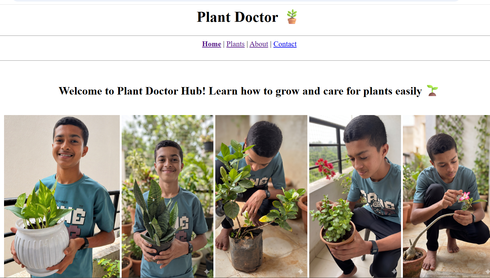
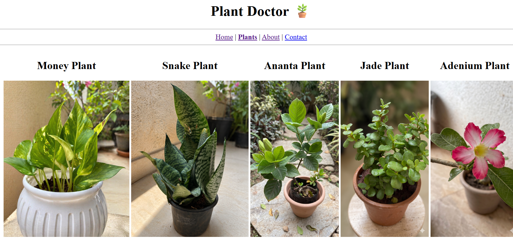

# 🌿 Plant Doctor

Plant Doctor is a simple and user-friendly website that helps users learn about indoor plants and how to take care of them. 🪴

## 📌 Features
- Information about different plants  
-  Individual plant detail pages  
-  Contact page with form and map  
-  Easy navigation  

## 🗂️ Pages
- Home  
- Plants  
- About  
- Contact  

## 🛠️ Technologies Used
- HTML5  

## 🚀 How to Run
1. Download or clone the project  
2. Open `index.html` in your browser  

## 📞 Contact
- 📧 Email: saihole2010@gmail.com  
- 📱 Phone: 9975402726  

## 👨‍💻 Author
Made with ❤️ by voyager2010  
